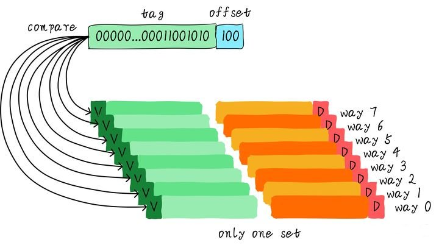
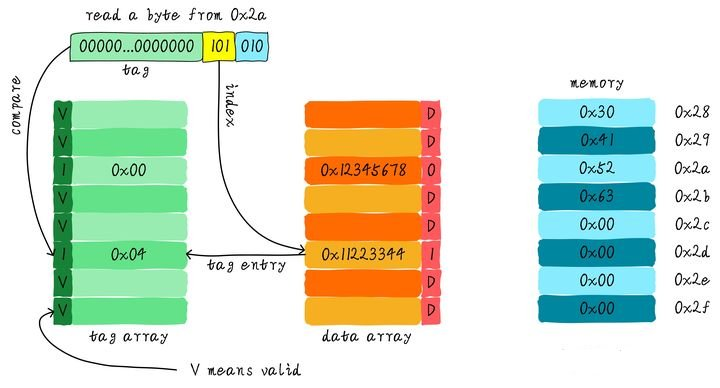
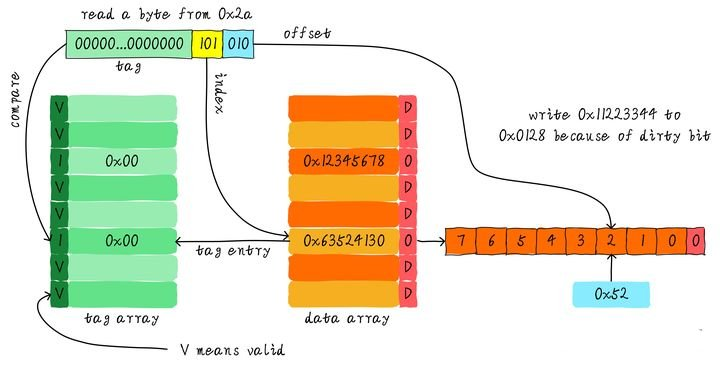

# Cache的基本原理

## 为什么需要cache

我们应该知道程序是运行在 RAM之中，RAM 就是我们常说的DDR（例如： DDR3、DDR4等）。我们称之为main memory（主存）。当我们需要运行一个进程的时候，首先会从磁盘设备（例如，eMMC、UFS、SSD等）中将可执行程序load到主存中，然后开始执行。在CPU内部存在一堆的通用寄存器（register）。如果CPU需要将一个变量（假设地址是A）加1，一般分为以下3个步骤：

1. CPU 从主存中读取地址A的数据到内部通用寄存器 x0（ARM64架构的通用寄存器之一）。
2. 通用寄存器 x0 加1。
3. CPU 将通用寄存器 x0 的值写入主存。

我们将这个过程可以表示如下：

其实现实中，CPU通用寄存器的速度和主存之间存在着太大的差异。两者之间的速度大致如下关系：

CPU register的速度一般小于1ns，主存的速度一般是65ns左右。速度差异近百倍。因此，上面举例的3个步骤中，步骤1和步骤3实际上速度很慢。当CPU试图从主存中load/store 操作时，由于主存的速度限制，CPU不得不等待这漫长的65ns时间。如果我们可以提升主存的速度，那么系统将会获得很大的性能提升。如今的DDR存储设备，动不动就是几个GB，容量很大。如果我们采用更快材料制作更快速度的主存，并且拥有几乎差不多的容量。其成本将会大幅度上升。我们试图提升主存的速度和容量，又期望其成本很低，这就有点难了。因此，我们有一种折中的方法，那就是制作一块速度极快但是容量极小的存储设备。那么其成本也不会太高。这块存储设备我们称之为**cache memory**。在硬件上，我们将cache（CPU芯片的一部分）放置在CPU和主存之间，作为主存数据的缓存。 当CPU试图从主存中load/store数据的时候， CPU会首先从cache中查找对应地址的数据是否缓存在cache 中。如果其数据缓存在cache中，直接从cache中拿到数据并返回给CPU。以上程序运行的流程如下图所示：

CPU和主存之间直接数据传输的方式转变成CPU和cache之间直接数据传输。cache负责和主存之间数据传输。

## 多级cache存储结构

cahe的速度在一定程度上同样影响着系统的性能。一般情况cache的速度可以达到1ns，几乎可以和CPU寄存器速度媲美。为了进一步提升性能，引入多级cache。前面提到的cache，称之为L1 cache（第一级cache）。我们在L1 cache 后面连接L2 cache，在L2 cache 和主存之间连接L3 cache。等级越高，速度越慢，容量越大。但是速度相比较主存而言，依然很快。不同等级cache速度之间关系如下：

经过3级cache的缓冲，各级cache和主存之间的速度最萌差也逐级减小。在一个真实的系统上，各级cache之间硬件上是如何关联的呢？我们看下Cortex-A53架构上各级cache之间的硬件抽象框图如下：

在Cortex-A53架构上，L1 cache分为单独的instruction cache（ICache）和data cache（DCache）。L1 cache是CPU私有的，每个CPU都有一个L1 cache。一个cluster 内的所有CPU共享一个L2 cache，L2 cache不区分指令和数据，都可以缓存。所有cluster之间共享L3 cache。L3 cache通过总线和主存相连。

## 多级cache之间的配合工作

首先引入两个名词概念，命中和缺失。 CPU要访问的数据在cache中有缓存，称为“命中” (hit)，反之则称为“缺失” (miss)。多级cache之间是如何配合工作的呢？我们假设现在考虑的系统只有两级cache。

当CPU试图从某地址load数据时，首先从L1 cache中查询是否命中，如果命中则把数据返回给CPU。如果L1 cache缺失，则继续从L2 cache中查找。当L2 cache命中时，数据会返回给L1 cache以及CPU。如果L2 cache也缺失，我们需要从主存中load数据，将数据返回给L2 cache、L1 cache及CPU。这种多级cache的工作方式称为：包容型缓存(inclusive cache)。某一地址的数据可能存在多级缓存中。与inclusive cache对应的是exclusive cache，这种cache保证某一地址的数据缓存只会存在于多级cache其中一级。也就是说，任意地址的数据不可能同时在L1和L2 cache中缓存。

# Cache映射方式

## 直接映射方式

我们继续引入一些cache相关的名词。cache的容量称为cahe size，它保存的内容只是主存（内存）内容的一部分。由于，Cache与主存的数据交换是以块（**cache line**）为单位的。我们将cache平均分成相等的很多块，每个块称为cache line，其每个块大小是cache line size。例如cache容量为64 Bytes，被分成8块，每个block为`8 byte`。现在的硬件设计中，一般cache line的大小是4-128 Byts。

这里有一点需要注意，cache line是cache和主存之间数据传输的最小单位。什么意思呢？当CPU试图load一个字节数据的时候，如果cache缺失，那么cache控制器会从主存中一次性的load cache line大小的数据到cache中。例如，cache line大小是8字节。CPU即使读取一个byte，在cache缺失后，cache会从主存中load 8字节填充整个cache line。又是因为什么呢？后面会讲解。

我们假设下面的讲解都是针对64 Bytes大小的cache，并且cache line大小是8字节。我们可以类似把这块cache想想成一个数组，数组总共8个元素，每个元素大小是8字节。如下图所示:

现在考虑一个问题，CPU从`0x0654`地址读取一个字节，cache控制器是如何判断数据是否在cache中命中呢？cache大小相对于主存来说会小很多，所以cache肯定是只能缓存主存中极小一部分数据。我们如何根据地址在有限大小的cache中查找数据呢？现在硬件采取的做法是对地址进行散列（可以理解成地址取模操作）。举例说明:

- 上图共有8个块，每个块大小是8 Bytes。所以可以利用地址低3 bits（如上图地址蓝色部分）用来寻址8 bytes中某一字节，我们称这部分bit组合为**offset**。

- 8行`cache line`，为了能够覆盖到所有行。我们需要3 bits（如上图地址黄色部分）查找某一行，这部分地址部分称之为**index**。

- 如果两个不同的地址，其地址的bit3-bit5如果完全一样，那么这两个地址经过硬件散列之后都会找到同一个cache line。所以，当我们找到cache line之后，只代表我们访问的地址对应的数据可能存在这个cache line中，但是也有可能是其它址对应的数据。所以，我们又引入**tag array(区域)**，tag array和data array一一对应。每一个cache line都对应唯一一个tag，tag中保存的是整个地址位宽去除index和offset使用的bit剩余部分（如上图地址绿色部分）。

tag、index和offset三者组合就可以唯一确定一个地址。因此，当我们根据地址中index位找到cache line后，取出当前cache line对应的tag，然后和地址中的tag进行比较，如果相等，这说明cache命中。如果不相等，说明当前cache line存储的是其它地址的数据，这就是**cache缺失（cache miss）**。在上述图中，看到tag的值是0x19，和地址中的tag部分相等，因此在访问会命中（cache hit)。

由于tag的引入，**也就是“为什么硬件cache line不做成一个字节？”，这样会导致硬件成本的上升，因为原本8个字节对应一个tag，现在需要8个tag，占用了很多内存。**

从图中看到tag旁边还有一个**valid bit**，这个bit用来表示cache line中数据是否有效（例如：1代表有效；0代表无效）。当系统刚启动时，cache中的数据都应该是无效的，因为还没有缓存任何数据。cache控制器可以根据valid bit确认当前cache line数据是否有效。所以，上述比较tag确认cache line是否命中之前还会检查valid bit是否有效。只有在有效的情况下，比较tag才有意义。如果无效，直接判定cache缺失。

上面的例子中，cache size是64 Bytes并且cache line size是8 bytes。offset、index和tag分别使用3 bits、3 bits和42 bits（假设地址宽度是48 bits）。我们现在再看一个例子：512 Bytes cache size，64 Bytes cache line size。根据之前的地址划分方法，offset、index和tag分别使用6 bits、3 bits和39 bits。如下图所示。

**优点**  

直接映射缓存在硬件设计上会更加简单，因此成本上也会较低。

**缺点：**  

会造成chche的颠簸。导致Cache淘汰换出频繁，需要频繁的从主存读取数据到Cache，这个代价也较高。

**原因分析:**

根据直接映射缓存的工作方式，可以画出主存地址0x00-0x88地址对应的cache分布图。

可以看到，地址0x00-0x3f地址处对应的数据可以覆盖整个cache。0x40-0x7f地址的数据也同样是覆盖整个cache。现在思考一个问题，如果一个程序试图依次访问地址0x00、0x40、0x80，cache中的数据会发生什么呢？

- 首先0x00、0x40、0x80地址中index部分是一样的。因此，这3个地址对应的cache line是同一个。所以，当我们访问0x00地址时，cache会缺失，然后数据会从主存中加载到cache中第0行cache line。

- 当继续访问0x40地址时，依然索引到cache中第0行cache line，由于此时cache line中存储的是地址0x00地址对应的数据，所以此时依然会cache缺失。然后从主存中加载0x40地址数据到第一行cache line中。

- 同理，继续访问0x80地址，依然会cache缺失。这就相当于每次访问数据都要从主存中读取，所以cache的存在并没有对性能有什么提升。

访问0x40地址时，就会把0x00地址缓存的数据替换。这种现象叫做**cache颠簸（cache thrashing）**。

## 组相联映射方式

路（way）的概念：将cache平均分成多份，每一份就是一路。本小节我们依然假设cache size为64 Bytes ，cache line size是8 Bytes。以两路相连缓存为例(两路组相连缓存就是将cache平均分成2份，每份32 Bytes),如下图所示：

**工作过程:**   

  cache被分成2路，每路包含4行cache line。所有索引一样的cache line组合在一起称之为 组(set)。上图中一个组有两个cache line，总共4个组。我们依然假设从地址0x1234地址读取一个字节数据：由于cache line size是8 Bytes，因此offset需要3 bits，这和之前直接映射缓存一样。不一样的地方是index，在两路组相连缓存中，index只需要2 bits，因为一路只有4行cache line。上图中根据index找到第3行cache line，第3行对应2个cache line，分别对应way 0和way 1。因此index也可以称作 set index（组索引）。先根据index找到set，然后将组内的所有cache line对应的tag取出来和地址中的tag部分对比，如果其中一个相等就cache hit。

**两路组相连缓存优缺点：**   

  两路组相连缓存较直接映射缓存最大的差异就是：一个地址对应的数据可以对应2个cache line，而直接映射缓存一个地址只对应一个cache line。

**缺点：**   

  两路组相连缓存的硬件成本相对于直接映射缓存更高。因为其每次比较tag的时候需要比较多个cache line对应的tag（某些硬件可能还会做并行比较，增加比较速度，这就增加了硬件设计复杂度）。

**优点：**

  有助于降低cache颠簸可能性。

**原因如下：**   

  根据两路组相连缓存的工作方式，可以画出主存地址0x00-0x60地址对应的cache分布图。

对于两路组相连映射方式，如果一个程序试图依次访问地址0x00、0x40、0x80时：
  0x00地址的数据可以被加载到way 0，0x40可以被加载到way 1(0x80地址数据占不考虑)。这样就在一定程度上避免了直接映射缓存的颠簸现象。在两路组相连缓存的情况下，0x00和0x40地址的数据都可以被同时缓存在cache中。假设，如果我们是N路(多路)组相连缓存，后面继续访问0x80，也可以同时缓存在cache中。

  因此，当cache size一定的情况下，组相连缓存对性能的提升最差情况下也和直接映射缓存一样，在大部分情况下组相连缓存效果比直接映射缓存好。同时，其降低了cache颠簸的频率。从某种程度上来说，直接映射缓存是组相连缓存的一种特殊情况，每个组只有一个cache line而已。因此， 直接映射缓存也可以称作单路组相连缓存。

## 全相连映射方式

所有的cache line都在一个组内。这种缓存就是**全相连缓存**。依然以64 Byts大小cache, cache line size是8 Bytes为进行说明。

由于所有的cache line都在一个组内，因此地址中不需要set index部分。因为，只有一个组。根据地址中的tag部分和所有的cache line对应的tag进行比较（硬件上可能并行比较也可能串行比较）。哪个tag比较相等，就意味着命中某个cache line。

因此，在全相连缓存中，任意地址的数据可以缓存在任意的cache line中。所以，这可以最大程度的降低cache颠簸的频率。但是**硬件成本上也是更高。**

**总结**

  因此，综合成本的问题，同时为了解决直接映射高速缓存中的高速缓存颠簸问题，组相联（set associative）的高速缓存结构在现代处理器中得到广泛应用。

## 实例

假设我们有一个64 Bytes大小直接映射缓存，cache line大小是8 Bytes，采用写分配和写回机制。当CPU从地址0x2a读取一个字节，cache中的数据将会如何变化呢？假设当前cache状态如下图所示(tag旁边valid一栏的数字1代表合法。0代表非法。后面Dirty的1代表dirty，0代表没有写过数据，即非dirty)。

根据index找到对应的cache line，对应的tag部分valid bit是合法的，但是tag的值不相等，因此发生缺失。此时我们需要从地址0x28地址加载8字节数据到该cache line中。但是，我们发现当前cache line的dirty bit置位。因此，cache line里面的数据不能被简单的丢弃，由于采用写回机制，所以我们需要将cache中的数据0x11223344写到地址0x0128地址（这个地址根据tag中的值及所处的cache line行计算得到）。这个过程如下图所示。

当写回操作完成，我们将主存中0x28地址开始的8个字节加载到该cache line中，并清除dirty bit。然后根据offset找到0x52返回给CPU。

