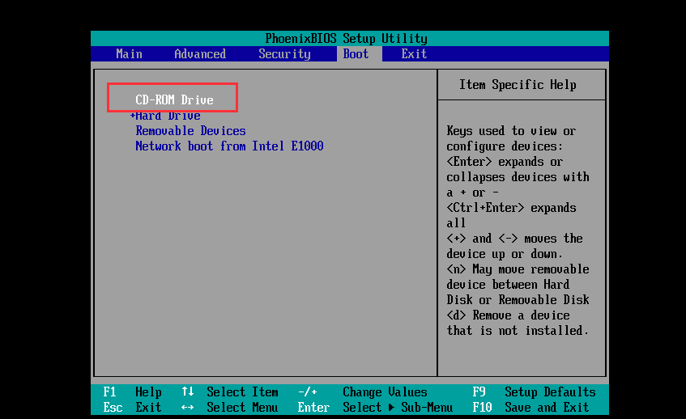
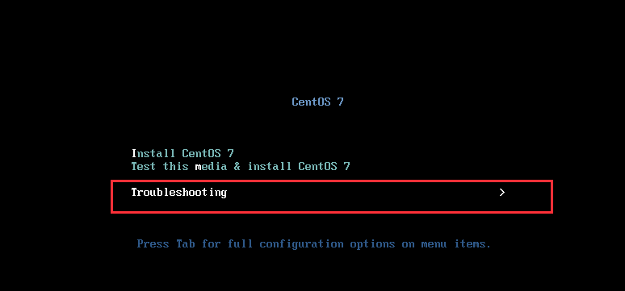
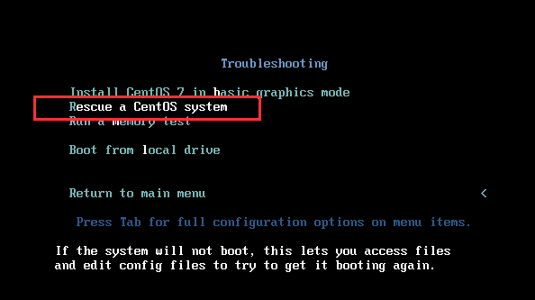
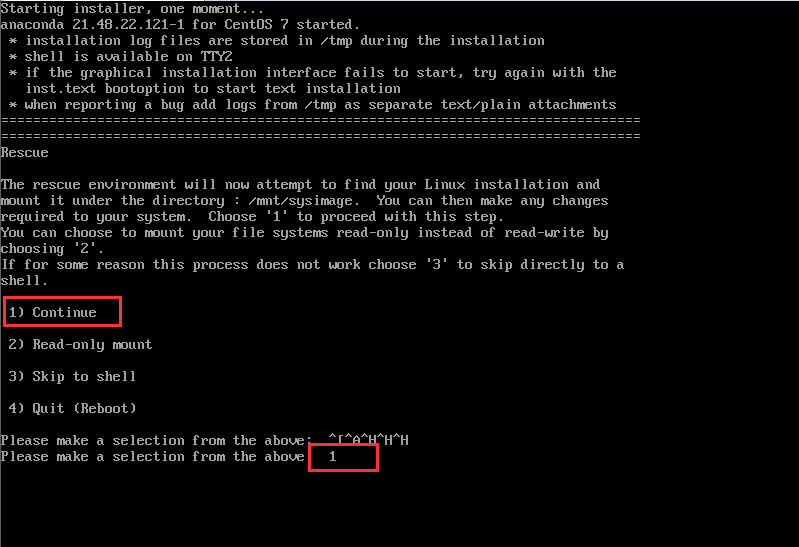
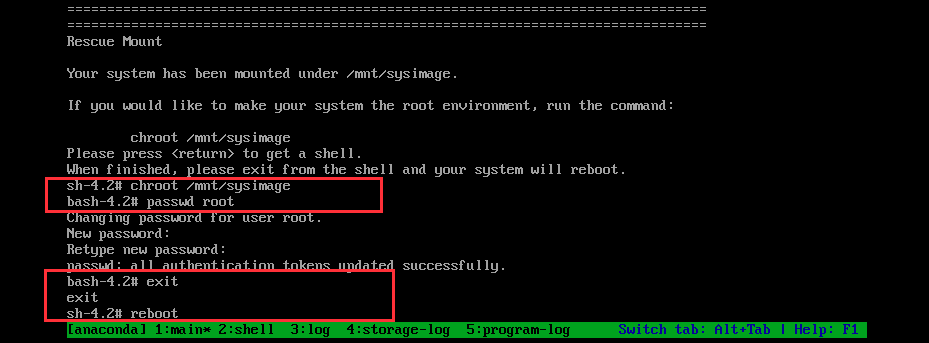
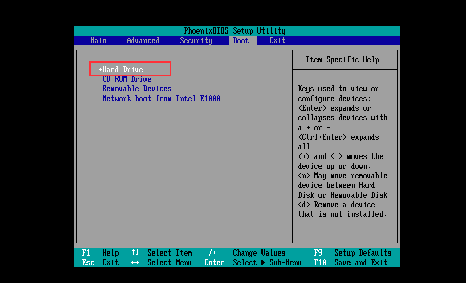
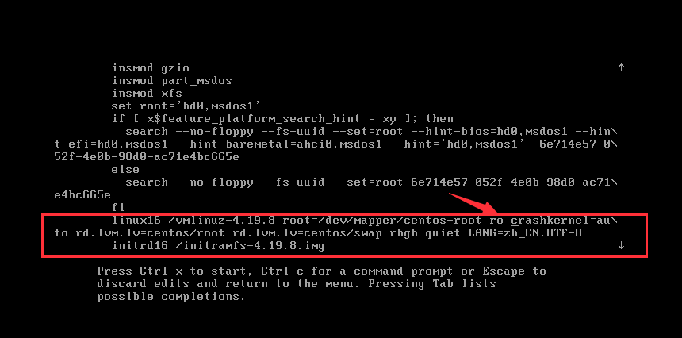
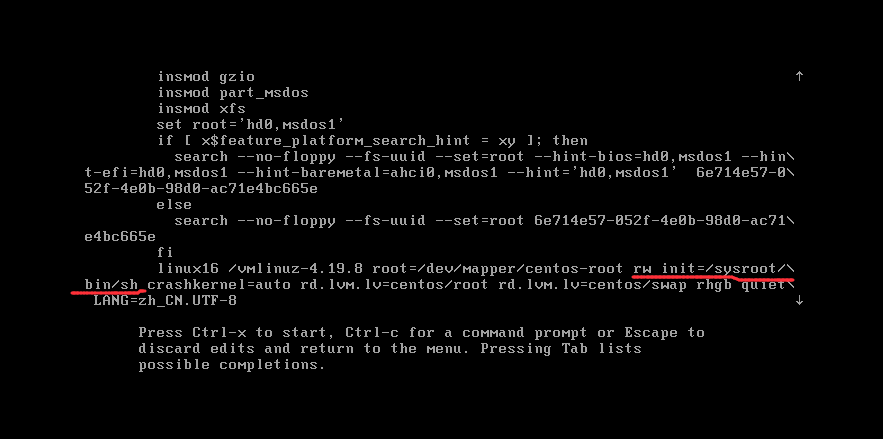
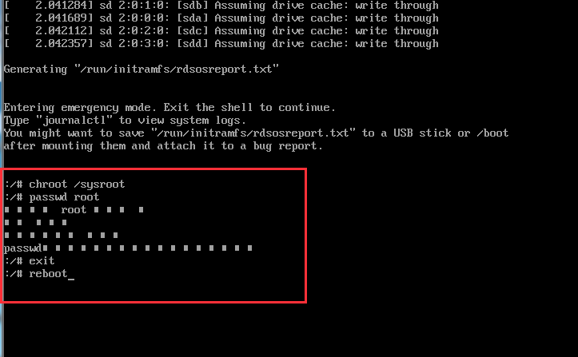

# CentOS 7 root密码忘记

   注：所有环境均在vmware虚拟机上实现

## 一.通过光盘镜像进入救援模式修改root密码

  1）在虚拟机关闭状态下，选择“打开电源时进入固件”或者在虚拟机启动时，按F2进入BIOS；然后通过键盘“左”、“右”键选择到“BOOT”， 使用方向键“上”、“下”和“+”“-”号将CD-ROM Drive调为第一启动方式，F10保存退出。




  2）系统重启后进入centos系统安装的界面，选择“Troubleshooting”，接着选择“Rescure a CentOS system”,进入系统救援模式；



 



  3）接着在光标后输入“1”，选择“continue”选项；



待系统刷新后，在系统环境输入以下命令, 并键入新的root用户的密码;

```shell
# chroot /mnt/sysimage
# passwd root
# exit
# reboot
```




接着重启系统，并将第一启动项修还原为“+Hard Drive”模式。



  4）至此通过光盘启动救援模式修改root密码就完成了，系统重启后，输入设置的root密码即可。


## 二.通过进入grub进行修改root密码


  1）开机时随便按下键盘，进入系统选择菜单，选择第一项，按e键进行修改；



  2）定位到 ro （ro=readonly 只读），把ro改成 “rw init=/sysroot/bin/sh”. 完成之后按Ctrl+x键，进入救援模式；



  3）进入单用户模式，依次输入以下命令进行root密码修改，完成之后强制重启即可

```shell
# chroot /sysroot/ （改变根）
# passwd root
# touch /.autorelabel （为了使selinux生效）
# exit
# reboot
```

